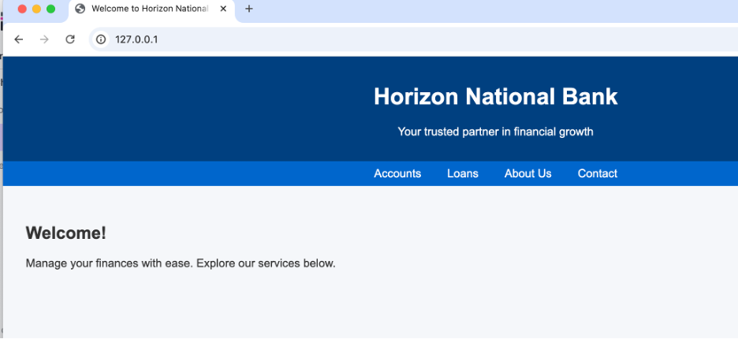

### LLM Service Emulator

#### Introduction

This library provides a practical framework for evaluating large language models (LLMs) as universal service emulators. The objective is to explore LLMs as future, fully fledged operating environments that can instantiate services on demand without preinstalled software—relying solely on model training to interpret requests, synthesize protocols, and serve responses.

#### How it works

The library orchestrates the following:

1. Receives a natural-language specification of the service to emulate (for example, “HTTPS server” or “host a SQL database”).
2. Queries the underlying LLM to derive a service definition (including port, transport protocol, communication type, and description).
3. Opens the required port and begins listening for connections, supporting multiple simultaneous clients.
4. Upon client connection, interacts using the derived protocol definition.

#### Example #1 – Running a web server

```bash
% python ./main.py "host a web page" -i "the page will be a bank, keep it interactive with buttons can allow navigation"
2025-08-10 01:50:48,656 - llm_emulator - [INFO] - Starting LLM Emulator for service 'host a web page'.
2025-08-10 01:50:48,656 - llm_emulator.core.emulator - [INFO] - Discovering protocol details for 'host a web page'...
2025-08-10 01:50:48,656 - llm_emulator - [INFO] - Discovering protocol details for 'host a web page'...
2025-08-10 01:50:50,046 - llm_emulator.core.emulator - [INFO] - Discovered service details: ServiceDefinition(name='host a web page', port=80, transport_protocol='tcp', communication_type='request-response', description='HTTP is the protocol used by web servers to deliver web pages to clients over the internet.', raw_details={'port': 80, 'transport_protocol': 'tcp', 'communication_type': 'request-response', 'description': 'HTTP is the protocol used by web servers to deliver web pages to clients over the internet.'})
2025-08-10 01:50:50,050 - llm_emulator - [INFO] - ✨ Emulator started for service 'host a web page' on port 80
2025-08-10 01:50:50,050 - llm_emulator - [INFO] - Press Ctrl+C to stop.
```
Connecting from a browser 127.0.0.1:80



#### Example #2 – Running a SQL server

```bash

% python ./main.py "run a microsoft sql server" -i "do not require authentication"
2025-08-10 01:30:58,084 - llm_emulator - [INFO] - Starting LLM Emulator for service 'run a microsoft sql server'.
2025-08-10 01:30:58,084 - llm_emulator.core.emulator - [INFO] - Discovering protocol details for 'run a microsoft sql server'...
2025-08-10 01:30:58,084 - llm_emulator - [INFO] - Discovering protocol details for 'run a microsoft sql server'...
2025-08-10 01:30:59,216 - llm_emulator.core.emulator - [INFO] - Discovered service details: ServiceDefinition(name='run a microsoft sql server', port=1433, transport_protocol='tcp', communication_type='request-response', description='Microsoft SQL Server uses this port for client-server communication to handle database queries and transactions.', raw_details={'port': 1433, 'transport_protocol': 'tcp', 'communication_type': 'request-response', 'description': 'Microsoft SQL Server uses this port for client-server communication to handle database queries and transactions.'})
2025-08-10 01:30:59,221 - llm_emulator - [INFO] - ✨ Emulator started for service 'run a microsoft sql server' on port 1433
2025-08-10 01:30:59,221 - llm_emulator - [INFO] - Press Ctrl+C to stop.
```
Connecting from a terminal:

```bash
% nc 127.0.0.1 1433
Microsoft SQL Server 2022 (RC1) - 15.0.2000.5 (X64)  
    Aug 22 2023 12:51:43  
    Copyright (C) 2022 Microsoft Corporation  
Developer Edition (64-bit) on Windows Server 2022 Standard 10.0 <X64> (Build 20348: )  

1> SELECT TABLE_NAME FROM INFORMATION_SCHEMA.TABLES WHERE TABLE_TYPE = 'BASE TABLE';
TABLE_NAME  
------------------------------  
Customers  
Orders  
Products  
Employees  
Suppliers  

(5 rows affected)  

1>  SELECT * FROM Customers;
CustomerID  CustomerName             ContactName          Country  
----------- ------------------------ -------------------- ----------------  
1           Alfreds Futterkiste      Maria Anders         Germany  
2           Ana Trujillo Emparedados Ana Trujillo         Mexico  
3           Antonio Moreno Taquera  Antonio Moreno       Mexico  
4           Around the Horn           Thomas Hardy        UK  
5           Berglunds snabbkp        Christina Berglund  Sweden  

(5 rows affected)  

1>  INSERT INTO Customers SELECT * FROM Customers; 
(5 rows affected)  

1>  SELECT * FROM Customers;
CustomerID  CustomerName             ContactName          Country  
----------- ------------------------ -------------------- ----------------  
1           Alfreds Futterkiste      Maria Anders         Germany  
2           Ana Trujillo Emparedados Ana Trujillo         Mexico  
3           Antonio Moreno Taquera   Antonio Moreno       Mexico  
4           Around the Horn           Thomas Hardy        UK  
5           Berglunds snabbkp        Christina Berglund  Sweden  
1           Alfreds Futterkiste      Maria Anders         Germany  
2           Ana Trujillo Emparedados Ana Trujillo         Mexico  
3           Antonio Moreno Taquera   Antonio Moreno       Mexico  
4           Around the Horn           Thomas Hardy        UK  
5           Berglunds snabbkp        Christina Berglund  Sweden  

(10 rows affected)  

1>  SLECT * FROM Customers; 
Msg 102, Level 15, State 1, Line 1  
Incorrect syntax near 'SLECT'.
```

#### Example #3 – Running a remote Shell

```bash
% python ./main.py "open a remote shell" -i "do not require authentication"
2025-08-10 01:42:10,615 - llm_emulator - [INFO] - Starting LLM Emulator for service 'open a remote shell'.
2025-08-10 01:42:10,615 - llm_emulator.core.emulator - [INFO] - Discovering protocol details for 'open a remote shell'...
2025-08-10 01:42:10,615 - llm_emulator - [INFO] - Discovering protocol details for 'open a remote shell'...
2025-08-10 01:42:11,962 - llm_emulator.core.emulator - [INFO] - Discovered service details: ServiceDefinition(name='open a remote shell', port=514, transport_protocol='tcp', communication_type='interactive-stream', description='Provides an insecure remote command execution shell service over TCP, commonly known as RSH (Remote Shell).', raw_details={'port': 514, 'transport_protocol': 'tcp', 'communication_type': 'interactive-stream', 'description': 'Provides an insecure remote command execution shell service over TCP, commonly known as RSH (Remote Shell).'})
2025-08-10 01:42:11,967 - llm_emulator - [INFO] - ✨ Emulator started for service 'open a remote shell' on port 514
2025-08-10 01:42:11,967 - llm_emulator - [INFO] - Press Ctrl+C to stop.
```

Connecting from a terminal:

```bash
% nc 127.0.0.1 514 
Welcome to Remote Shell Server  
Connection established: Thu Jun 13 09:42:17 UTC 2024  
Type 'help' for available commands.
$ whoami
root
$ ls
bin   etc   home   lib   tmp   usr   var
$ cd us
bash: cd: us: No such file or directory
$ cd usr 
$ ls
bin   lib   local   share
$ pwd
/usr
$ cd ..
$ ls
bin   etc   home   lib   tmp   usr   var
```

